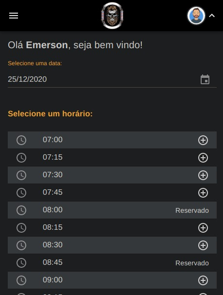
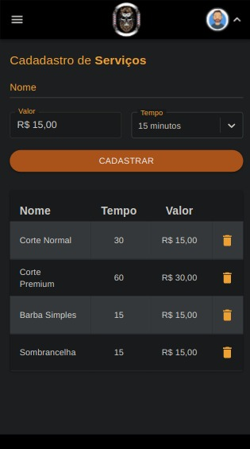

# A MOBILE FIRST SYSTEM TO BARBERSHOP SCHEDULES

 - ARCHITECTURE MULTI TENANT - SINGLE DATABASE

 - Front End: 
  React, Framework Next JS, Redux, Sagas, Material UI Components, Formik.

 - Back End:
  API Developed with Adonis JS.
  
 - DATA BASE: 
  MySql

